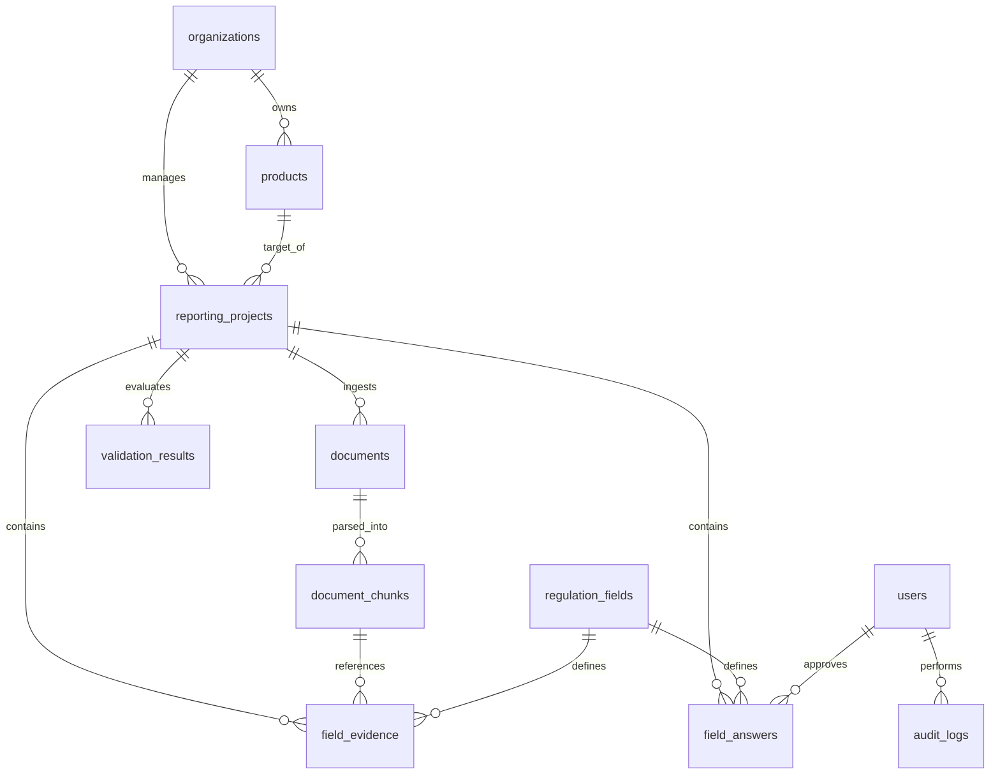

# SFDR Compliance Workspace 🌿💼

An enterprise-ready, GenAI-powered regulatory compliance workspace designed to automate and audit Sustainable Finance Disclosure Regulation (SFDR) Regulatory Technical Standards (RTS) reporting for asset managers.

This application simplifies the complex process of compiling entity-level Principal Adverse Impact (PAI) indicators and periodic financial product disclosures (Article 8 & Article 9) by leveraging layout-aware RAG, LLM-based extraction, programmatic validation, and multi-user reviewer workflows.

---

## 🚀 Key Features

* **RAG-Driven Ingestion & Retrieval**: Layout-aware parsing of PDF/TXT sustainability reports using PyMuPDF, segmented into logical semantic chunks with MD5-based deduplication hashes.
* **GenAI Extraction & Drafting**: Connects to the **Groq SDK** (supporting `llama-3.3-70b-versatile` and `llama-3.1-8b-instant`) to extract precise numeric values, units, and direct audit quotes from context, drafting professional regulatory narratives.
* **Audit-Grade Traceability**: Tracks `regulation_version`, `prompt_version`, and `model_parameters` for every drafted response to ensure compliance outputs are fully reproducible.
* **Versioned Draft History**: Implements a `version_no` and `is_latest` versioning system on disclosure answers to track the evolution of drafts and reviewer overrides without data loss.
* **Multi-User Reviewer Workflows**: Dedicated roles (`Reviewer`, `ComplianceOfficer`, `Administrator`) with database-backed user validation, linking approvals and rejections directly to audited actors.
* **Automated Compliance Rules Engine**: Programmatic sanitization and validation checks checking for:
  - Numeric type safety and out-of-bounds metrics (e.g. percentages outside 0–100%).
  - Unusual negative ESG values.
  - Unit normalization mismatches (e.g. converting raw values to standard tCO2e or tonnes/EURm).
  - Completeness of mandatory RTS fields.
  - Citations provenance (warning on low LLM confidence or missing source quotes).
* **Compliance Package Exports**: Direct compiles of disclosures into audit-ready Markdown bundles or print-ready glassmorphic HTML reports.
* **Glassmorphic Dark-Themed SPA**: A stunning, modern, responsive frontend dashboard utilizing HSL colors, smooth transitions, and live state updates.

---

## 🛠️ Technology Stack

* **Backend**: Python 3.10+, FastAPI (Asynchronous REST API), Pydantic v2 (Contracts & Validation).
* **Database & Migrations**: SQLite (local-first design), SQLAlchemy 2.0 (ORM), Alembic (Schema Migrations).
* **Large Language Models**: Groq Cloud SDK (Llama 3.3/3.1) with a high-fidelity simulated local fallback engine.
* **Document Processing**: PyMuPDF (`fitz`) for PDF parsing.
* **Frontend**: HTML5, Vanilla ES6+ JavaScript, CSS3 (Glassmorphism & animations).

---

## 🗄️ Database Schema Architecture

The database contains 11 tables designed for enterprise trace-trails:



### Main Entities
* **`User`**: Tracks active reviewers, compliance officers, and admins.
* **`RegulationField`**: Seeded dictionary of SFDR RTS regulatory indicators (e.g. GHG emissions, board diversity, top investments).
* **`FieldEvidence`**: Stores extracted values, units, confidence scores, and source quotes from specific `DocumentChunks`. Enforces composite uniqueness on `(project_id, regulation_field_id, document_chunk_id, extraction_method)` to avoid duplicate citations.
* **`FieldAnswer`**: Stores disclosure statements. Tracks version history (`version_no`, `is_latest`) and links approvals relationally to the approving `User`.

---

## 🏁 Getting Started

### 1. Installation
Clone the repository and set up a Python virtual environment:
```powershell
# Create virtual environment
python -m venv .venv
.venv\Scripts\activate

# Install dependencies
pip install -r requirements.txt
```

### 2. Configure Environment Secrets
Create a `.env` file in the root directory:
```env
# Obtain your API key from https://console.groq.com/keys
GROQ_API_KEY=your_groq_api_key_here
```
*Note: If no API key is provided, the application will automatically run using its built-in high-fidelity simulation engine.*

### 3. Initialize the Database
Generate and apply database migrations using Alembic:
```powershell
# Run migrations
alembic upgrade head

# Seed default regulation fields and governance users
python -m app.seed_regulations
```

### 4. Run the Dev Server
Launch the FastAPI uvicorn application server:
```powershell
python -m uvicorn app.main:app --port 8000
```
Open **[http://127.0.0.1:8000](http://127.0.0.1:8000)** in your web browser to explore the dashboard.

---

## 🧪 E2E Verification Testing

A full E2E audit testing script is provided to verify all models, constraints, and pipelines:
```powershell
python tests_verify.py
```
This script validates:
1. Fresh database schema setup.
2. Ingestion and parsing of mock sustainability reports.
3. Keyword/Semantic RAG retrieval.
4. GenAI extraction and drafting.
5. Unique constraint deduplication on `FieldEvidence`.
6. Draft version incrementing on `FieldAnswer` edits.
7. Relation-linked User review and approvals.
8. Automated rules validation and export compilation.

---

## 📄 License
This project is proprietary and confidential. Created for regulatory compliance auditing under the SFDR RTS framework.
