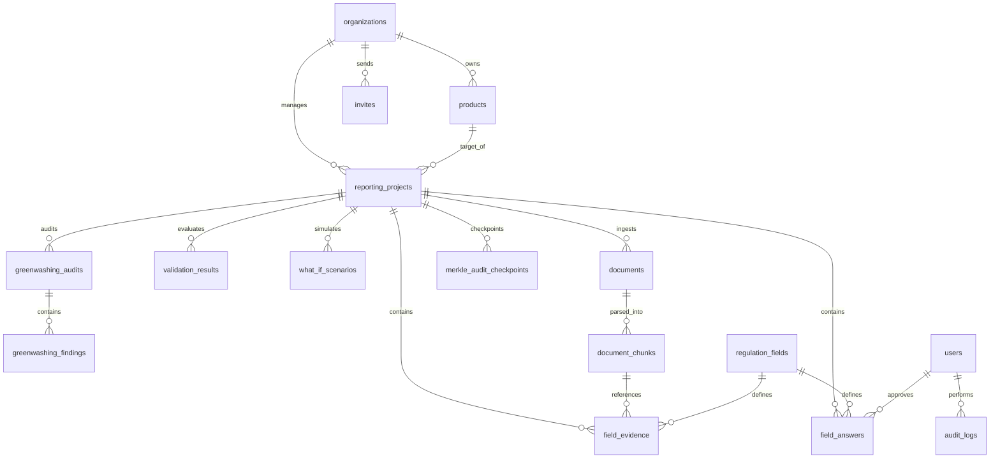

# Regulatory Intelligence & Compliance Workspace

An enterprise-ready, GenAI-powered regulatory compliance workspace designed to automate, audit, and simulate Sustainable Finance Disclosure Regulation (SFDR) Regulatory Technical Standards (RTS) reporting for asset managers.

This application simplifies the complex process of compiling entity-level Principal Adverse Impact (PAI) indicators and periodic financial product disclosures (Article 8 & Article 9) by leveraging layout-aware RAG, LLM-based extraction, programmatic validation, legal consequence mapping, a regulatory impact simulator, and multi-user reviewer workflows.

---

## Key Features

* **Regulatory Consequence Engine**: Enriches every disclosure requirement with legal basis metadata (specific RTS articles), penalty severity tiers (Low, Medium, High, Critical), and responsible enforcement bodies (e.g. ESMA, NCAs).
* **Automated Compliance Rules & Remediation Playbooks**: Programmatic sanitization and validation checks that link errors directly to legal risk evaluations and actionable, step-by-step remediation playbooks.
* **Regulatory Impact Simulator Dashboard**: A simulation sandbox that allows compliance officers to test hypothetical scenarios (e.g. removing Scope 3 disclosures, dropping board gender diversity below 30%, or reclassifying funds between SFDR Article 6/8/9) to predict triggered obligations and risk scores.
* **Cross-Framework Alignment**: Relationally maps SFDR requirements to equivalent standards in other frameworks (such as CSRD ESRS indicators).
* **Anti-Greenwashing Contradiction Detector**: Scans marketing materials for quantified/absolute claims ("100% green", "zero fossil fuels") and cross-checks them against audited regulatory disclosures to surface discrepancies with legal citations, penalty tiers, and remediation playbooks.
* **Multi-Jurisdictional Cross-Framework Harmonizer**: "Report once, comply everywhere." Resolves equivalent disclosures across SFDR, CSRD, SEC Climate Rule, UK SDR (FCA), and ISSB S1/S2 — auto-populating secondary frameworks from primary disclosures.
* **RAG-Driven Ingestion & Retrieval**: Layout-aware parsing of PDF/TXT sustainability reports using PyMuPDF, segmented into logical semantic chunks with MD5-based deduplication hashes.
* **Audit-Grade Traceability**: Relationally tracks `regulation_version`, `prompt_version`, and `model_parameters` for every drafted response, alongside detailed system audit logs relationally linked to actions.
* **Versioned Draft History**: Implements a `version_no` and `is_latest` versioning system on disclosure answers to track the evolution of drafts and reviewer overrides without data loss.
* **Multi-User Reviewer Workflows**: Dedicated roles (`Reviewer`, `ComplianceOfficer`, `Administrator`) with database-backed user validation, linking approvals and rejections directly to audited actors.
* **Compliance Package Exports**: Direct compiles of disclosures into audit-ready Markdown bundles or print-ready HTML reports.

---

## Technology Stack

| Layer | Technology |
|---|---|
| **Backend** | Python 3.12, FastAPI, Pydantic v2 |
| **Database** | PostgreSQL 17 (Neon) with SQLAlchemy 2.0 + Alembic migrations |
| **LLM** | Groq Cloud SDK (Llama 3.3/3.1) with local fallback engine |
| **Document Processing** | PyMuPDF (fitz), lxml |
| **Frontend** | React 19, Vite 8, TailwindCSS 3, Framer Motion |
| **Auth** | JWT (python-jose), bcrypt, RBAC |
| **Rate Limiting** | SlowAPI (in-memory or Redis-backed) |
| **Background Jobs** | Celery (optional Redis broker, degrades gracefully) |
| **Observability** | Sentry SDK, structured JSON logging |

---

## Deployment

### Live URLs

| Service | URL | Provider |
|---|---|---|
| **Backend API** | https://clarix-backend-0tz3.onrender.com | Render |
| **Frontend SPA** | https://clarix-tan-ten.vercel.app | Vercel |
| **Database** | Neon Serverless PostgreSQL | Neon |

### Architecture

```
                    ┌─────────────────┐
                    │   Vercel CDN    │
                    │  (React SPA)    │
                    └────────┬────────┘
                             │ /api/* rewrites
                    ┌────────▼────────┐
                    │  Render (Docker) │
                    │  FastAPI + Uvi.. │
                    └────────┬────────┘
                             │
                    ┌────────▼────────┐
                    │  Neon PostgreSQL │
                    └─────────────────┘
```

### Docker

The project includes a multi-stage Dockerfile that builds the frontend and backend into a single container:

```bash
# Build
docker build -t clarix .

# Run (requires .env with SECRET_KEY and DATABASE_URL)
docker run -p 8000:8000 --env-file .env clarix
```

Or use Docker Compose for the full local stack (app + PostgreSQL):

```bash
# Copy and configure environment
cp .env.example .env
# Edit .env with your SECRET_KEY and DATABASE_URL

# Start both services
docker compose up --build
```

---

## CI/CD Pipeline

Automated pipeline via GitHub Actions. Every push to `main` runs:

```
git push to main
    |
    v
Lint (ruff) --> Unit Tests (pytest) --> Migration Check --> Deploy to Render
    |
    +-- PR / develop branch: checks only, no deploy
```

### Pipeline Jobs

| Job | What it does |
|---|---|
| **Lint** | Runs `ruff check` on backend code |
| **Test** | Spins up PostgreSQL 16, runs `pytest tests/ -v` |
| **Migration Check** | Verifies Alembic migrations apply cleanly on a fresh database |
| **Deploy** | Triggers Render deploy via API, waits for build, verifies `/healthz` |

### Manual Deploy

From the GitHub Actions tab, run the **"Deploy to Render"** workflow manually to re-deploy without a code push.

---

## Environment Variables

| Variable | Required | Description |
|---|---|---|
| `SECRET_KEY` | Yes | JWT signing secret. Generate: `python -c "import secrets; print(secrets.token_hex(32))"` |
| `DATABASE_URL` | Yes | PostgreSQL connection string (Neon pooled URL) |
| `ENVIRONMENT` | No | `production` (default), `staging`, or `development` |
| `GROQ_API_KEY` | No | Groq API key for LLM. Leave empty for local fallback |
| `ALLOWED_ORIGINS` | No | Comma-separated CORS origins |
| `ENCRYPT_AT_REST` | No | `true` to encrypt uploaded files with AES-256-GCM |
| `ENCRYPTION_KEY` | No | Base64-encoded 32-byte key for at-rest encryption |
| `LOG_FORMAT` | No | `json` or `text` (default: text) |
| `CELERY_BROKER_URL` | No | Redis URL for background jobs (falls back to in-process) |
| `CELERY_RESULT_BACKEND` | No | Redis URL for job results |

See `.env.example` for the full template with all available variables.

### GitHub Secrets (for CI/CD)

| Secret | Purpose |
|---|---|
| `RENDER_API_KEY` | Auth for Render deploy API |
| `RENDER_SERVICE_ID` | Identifies the Render web service to deploy |
| `DATABASE_URL` | PostgreSQL connection string (injected into Render) |
| `SECRET_KEY` | JWT signing secret |
| `GROQ_API_KEY` | LLM provider key |
| `ALLOWED_ORIGINS` | CORS allowlist |

---

## Database Schema

The database contains 18 tables designed for enterprise trace-trails:


```mermaid
erDiagram
    organizations ||--o{ products : owns
    organizations ||--o{ reporting_projects : manages
    products ||--o{ reporting_projects : target_of
    reporting_projects ||--o{ documents : ingests
    reporting_projects ||--o{ field_answers : contains
    reporting_projects ||--o{ field_evidence : contains
    reporting_projects ||--o{ validation_results : evaluates
    reporting_projects ||--o{ what_if_scenarios : simulates
    reporting_projects ||--o{ greenwashing_audits : audits
    greenwashing_audits ||--o{ greenwashing_findings : contains
    documents ||--o{ document_chunks : parsed_into
    document_chunks ||--o{ field_evidence : references
    regulation_fields ||--o{ field_answers : defines
    regulation_fields ||--o{ field_evidence : defines
    users ||--o{ field_answers : approves
    users ||--o{ audit_logs : performs
    organizations ||--o{ invites : sends
    reporting_projects ||--o{ merkle_audit_checkpoints : checkpoints
```

### Main Entities
* **`User`**: Tracks active reviewers, compliance officers, administrators, and the automated `system` agent.
* **`Organization`**: Multi-tenant organization container.
* **`Invite`**: Team member invitations with token-based acceptance.
* **`RegulationField`**: Dictionary of SFDR RTS regulatory indicators enriched with legal basis, penalty tiers, enforcement body, and CSRD cross-references.
* **`FieldEvidence`**: Stores extracted values, units, confidence scores, and source quotes.
* **`FieldAnswer`**: Stores disclosure statements, tracking version history (`version_no`, `is_latest`).
* **`WhatIfScenario`**: Persists historical regulatory impact simulations and risk scores.
* **`GreenwashingAudit`** & **`GreenwashingFinding`**: Track contradiction scans between marketing claims and audited disclosures.
* **`MerkleAuditCheckpoint`**: Immutable audit trail checkpoints.
* **`AuditLog`**: Relational audit trails linked directly to the acting user.

---

## Getting Started

### Option 1: Docker (Recommended)

```bash
# Clone and configure
git clone https://github.com/mananjp/Clarix.git
cd Clarix
cp .env.example .env
# Edit .env: set SECRET_KEY, DATABASE_URL (or USE_POSTGRES=true for local Postgres)

# Start with Docker Compose (app + PostgreSQL)
docker compose up --build
```

Open **http://localhost:8000** in your browser.

### Option 2: Local Development

```bash
# Backend
python -m venv .venv
.venv\Scripts\activate          # Windows
# source .venv/bin/activate    # macOS/Linux
pip install -r requirements.txt

# Configure environment
cp .env.example .env
# Edit .env with your secrets

# Run migrations and seed
alembic upgrade head
python -m app.seed_regulations

# Start backend
uvicorn app.main:app --port 8000

# Frontend (separate terminal)
cd frontend
npm install
npm run dev
```

### 3. Create Admin User

```bash
python scripts/create_first_admin.py
```

---

## Testing

```bash
# Unit + integration tests
pytest tests/ -v

# Lint
ruff check app/ tests/ scripts/

# Migration integrity check
python scripts/check_migrations.py
```

---

## API Documentation

Once running, visit **http://localhost:8000/docs** for the interactive Swagger UI or **http://localhost:8000/redoc** for ReDoc.

---

## Project Structure

```
Clarix/
├── app/                    # FastAPI backend
│   ├── main.py             # App factory, middleware, startup
│   ├── config.py           # Environment configuration
│   ├── models.py           # SQLAlchemy models (18 tables)
│   ├── schemas.py          # Pydantic v2 schemas
│   ├── auth.py             # JWT auth, RBAC
│   ├── routers/            # 27 API route modules
│   └── services/           # 25 business logic modules
├── alembic/                # Database migrations
├── frontend/               # React SPA (Vite + TailwindCSS)
├── tests/                  # Unit + integration tests
├── scripts/                # Admin provisioning, maintenance
├── docs/                   # Security, SOC2, DPA docs
├── Dockerfile              # Multi-stage build
├── docker-compose.yml      # Local dev stack
├── render.yaml             # Render Blueprint
├── .github/workflows/      # CI/CD (GitHub Actions)
│   ├── ci.yml              # Lint, test, migrate, deploy
│   └── deploy.yml          # Manual deploy trigger
└── requirements.txt        # Python dependencies
```

---

## License

This project is proprietary and confidential. Created for regulatory compliance auditing under the SFDR RTS framework.
